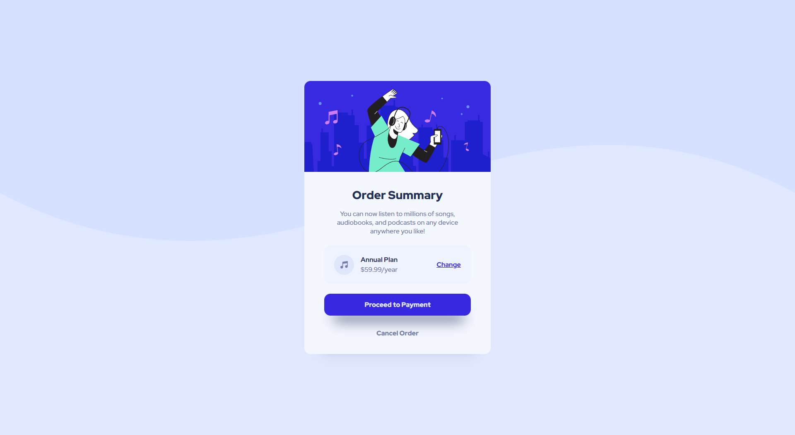

# Frontend Mentor - Order summary card solution

This is a solution to the [Order summary card challenge on Frontend Mentor](https://www.frontendmentor.io/challenges/order-summary-component-QlPmajDUj). Frontend Mentor challenges help you improve your coding skills by building realistic projects.

## Table of contents

- [Frontend Mentor - Order summary card solution](#frontend-mentor---order-summary-card-solution)
  - [Table of contents](#table-of-contents)
  - [Overview](#overview)
    - [Screenshot](#screenshot)
    - [Links](#links)
  - [My process](#my-process)
    - [Built with](#built-with)
    - [What I learned](#what-i-learned)
    - [Continued development](#continued-development)
    - [Useful resources](#useful-resources)
  - [Author](#author)

## Overview

### Screenshot




### Links

- Solution URL: [GitHub](https://github.com/maciej-szeremeta/Order-summary-card-solution)
- Live Site URL: [GitHub Page](https://maciej-szeremeta.github.io/Order-summary-card-solution/)

## My process

### Built with

- HTML
- CSS
- CSS variables
- BEM
- Flexbox

### What I learned

In the current projection, I have attempted to apply the BEM methodology.

```html
<div class="text">
  <h1 class="text__title">Order Summary</h1>
  <p class="text__description">
    You can now listen to millions of songs, audiobooks, and podcasts on any
    device anywhere you like!
  </p>
</div>
```

```css
.text {
  text-align: center;
  margin-bottom: 1.5rem;
}
.text__title {
  font-size: 1.75rem;
  font-weight: 900;
  margin: 1rem 0;
  color: var(--darkBlueColor);
}
.text__description {
  margin: 1rem 48px;
  color: var(--desaturatedBlueColor);
}
```

### Continued development

In the next task, I will focus on using the SCSS preprocessor. The SCSS preprocessor works well with BEM.

### Useful resources

- [BEM](https://en.bem.info/methodology/css/) - This page helped me understand how BEM.

## Author

- Frontend Mentor - [@maciej-szeremeta](https://www.frontendmentor.io/profile/maciej-szeremeta)
